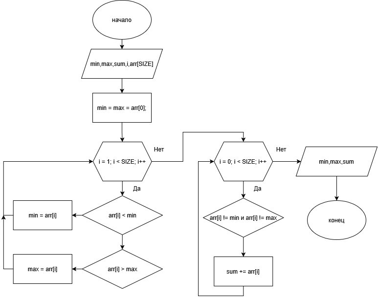

# Домашнее задание к работе 11

## Условие задачи

##### Сумму элементов массива, за исключением минимального и максимального значения.
---
## 1. Алгоритм и блок-схема

### Алгоритм
1. Начало
2. Задать исходные данные:
	- `min` - минимальный элемент массива
	- `max` - максимальный элемент массива
	- `sum` - сумма элементов массива
	- `arr[SIZE]` - массив из SIZE элементов
	- `i` - счетчик для цикла с параметром

3. Ввод данных:

    - `Цикл для ввода элементов массива с клавиатуры`
	- `Значение сохраняется в массив`

4. Поиск минимального и максимального элементов:

    - `Инициализация: min = max = arr[0]`

    - `Цикл по всем элементам массива (со второго до последнего)`

    - `Сравнение каждого элемента с текущими min и max`

    - `Обновление значений min и max при необходимости`

5. Вычисление суммы:

    - `Цикл по всем элементам массива`

    - `Если элемент не равен min И не равен max, то добавляем его к сумме`


6. Вывод результата:

    - `Печать минимального элемента` 
	- `Печать максимального элемента` 
	- `Печать итоговой суммы элементов` 

7. Конец

  

### Блок-схема

  



---

## 2. Реализация программы

  

```c

#define _CRT_SECURE_NO_WARNINGS
#include <stdio.h>
#include <stdlib.h>
#include <math.h>
#include <locale.h>
#define SIZE 10


int main()
{
    setlocale(LC_CTYPE, "RUS");
    int arr[SIZE], i;
    int min, max, sum = 0;

    for (i = 0; i < SIZE; i++)
    {
        printf("arr[%d] = ", i);
        scanf("%d", &arr[i]);
    }

    min = max = arr[0];
    for (i = 1; i < SIZE; i++)
    {
        if (arr[i] < min) min = arr[i];
        if (arr[i] > max) max = arr[i];
    }


    for (i = 0; i < SIZE; i++)
    {
        if (arr[i] != min && arr[i] != max)
        {
            sum += arr[i];
        }
    }
    printf("Минимальный элемент: %d\n", min);
    printf("Максимальный элемент: %d\n", max);
    printf("Сумма элементов = %d\n", sum);

    return 0;
}


```

  

# 3. Результаты работы программы

  

```bash

Минимальный элемент: 1
Максимальный элемент: 10
Сумма элементов = 44

```

